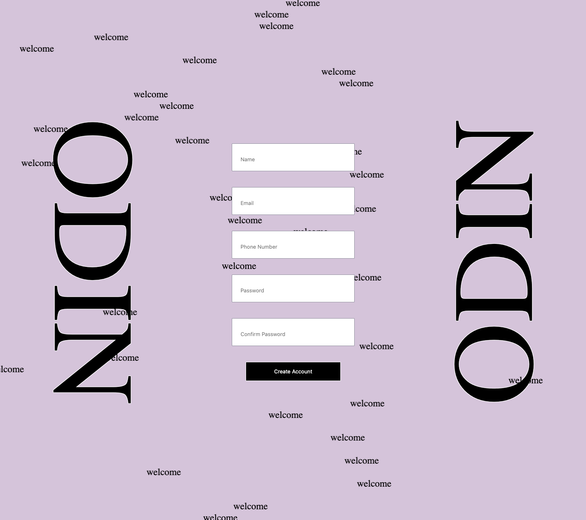
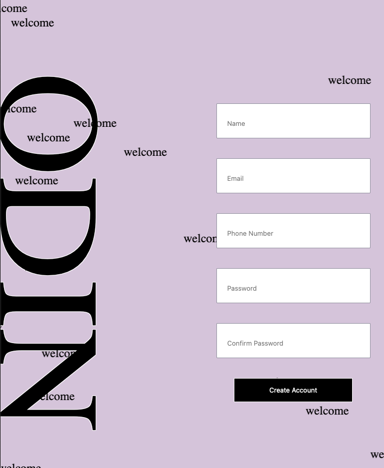
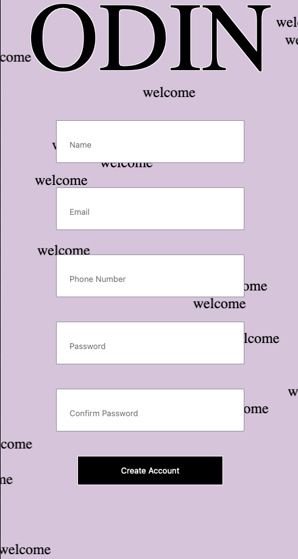

# Sign-Up Form Project!
A live implementation of the project can be found at this [GitHub Pages Link](https://lilyrubyroy.github.io/sign-up-form/).

## Design Philosophy
### Brutalism
Brutalism is a style of architecture, and web-design, characterized by a harsh and raw visual appearance, using elementary
elements to bring forth the building blocks themselves as the focal point of the piece. 

For me, this included elements of an unstyled web-page (serif font, simple background color, black text), as well
as elements of streetwear designs (skewed lettering, unconventional text placement, busy background pattern).

And ultimately, I decided to change the direction of the initial design-spec since it was something relatively
simple to implement, especially with modern CSS frameworks, and wanted to do something a bit more creative and custom, 
that also aligned with a design philosophy that I felt is too often overlooked.

## Initial Goals
The idea of a sign-up form is a lot simpler than its implementation. Here are a few things I had to think about throughout
the project, as well as overall goals I had going into it.

- Validate all of our fields in our sign-up form using an appropriate pattern
- Display appropriate error messages whenever mal-formatted data is entered
- Make the webpage responsive
- Come up with a fun design

The hardest part of a sign-up form is always keeping track of the state of the form as a whole in relation to 
the other fields. Up to this point, we had been used to atomic level functions, where one part of the program was either
like a light switch, where it either was on or off always, or the functions didn't really have to worry about what the other
functions were doing. 

So using a pseudo-state management system throughout made it an interesting, but fun challenge overall.

## Layouts
### Full Layout

### Half Layout

### Mobile Layout

